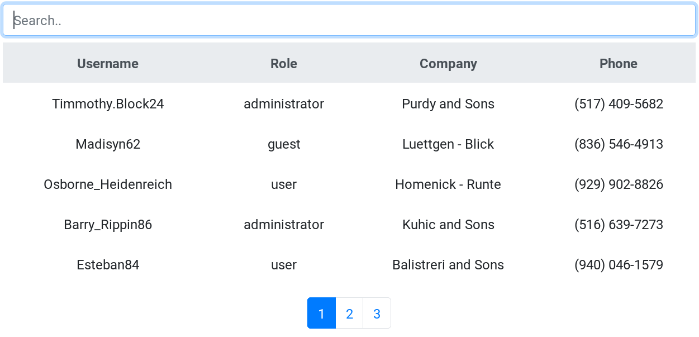

# Searchable React Table
A searchable table react component that can filter items in real time and handle pagination.



## Set up
`srt` can be installed from [`npm`](https://www.npmjs.com/package/@ds-labs.xyz/srt) by running:
```
npm i @ds-labs.xyz/srt
```
## Usage
First of all, import the component:
```js
import {GenericTable} from "@ds-labs.xyz/srt"
```
These are the properties that it takes:
```jsx
Pagination.propTypes = {
    items: PropTypes.array.isRequired,
    itemsPerPage: PropTypes.number.isRequired,
    columnNames: PropTypes.arrayOf(PropTypes.string).isRequired,
    itemToRow: PropTypes.func.isRequired,
    itemMatchesTerm: PropTypes.func.isRequired
}
```
For example, given some data:
```json
    data: [{"company":"Purdy and Sons","username":"Timmothy.Block24","password":"C6PUUiYZHqiyvll","role":"administrator","phone":"(517) 409-5682","cell":"(469) 920-8789"},{"company":"Luettgen - Blick","username":"Madisyn62","password":"rJtz10aE8kvBFKR","role":"guest","phone":"(836) 546-4913","cell":"(214) 449-5860"},{"company":"Homenick - Runte","username":"Osborne_Heidenreich","password":"JoLYgIw9eRC0WUx","role":"user","phone":"(929) 902-8826","cell":"(214) 610-5370"},{"company":"Kuhic and Sons","username":"Barry_Rippin86","password":"dT5HoDPN0ixGRv0","role":"administrator","phone":"(516) 639-7273","cell":"(214) 052-7641"},{"company":"Balistreri and Sons","username":"Esteban84","password":"Fk7YgXEccUfiUQw","role":"user","phone":"(940) 046-1579","cell":"(972) 703-1417"},{"company":"Erdman - Kozey","username":"Miles_Feest","password":"V8f4reHeaqFmlM9","role":"administrator","phone":"(248) 075-4973","cell":"(469) 128-7181"},{"company":"Dietrich - Cole","username":"Deonte.Kerluke","password":"8W9qVxvrXRIJAqt","role":"guest","phone":"(815) 967-9067","cell":"(972) 843-7598"},{"company":"Walsh Group","username":"Alivia_Rau21","password":"zGZOMlsOrEwqFGr","role":"guest","phone":"(946) 967-2252","cell":"(469) 814-8877"},{"company":"Jacobs - Jerde","username":"Saige.McLaughlin2","password":"BBpslmHdfHCrhYy","role":"guest","phone":"(358) 609-5599","cell":"(972) 293-1447"},{"company":"Ritchie - Cummerata","username":"Camden.Kilback","password":"92YIA1SjnOERTEw","role":"guest","phone":"(389) 048-1385","cell":"(214) 140-1095"},{"company":"Ullrich - Walsh","username":"Osbaldo.Wyman","password":"k63W2NH93WH5r2m","role":"user","phone":"(130) 363-1766","cell":"(972) 073-5383"},{"company":"Lebsack - O'Conner","username":"Arthur65","password":"Jx7ub9IuI8qYs1X","role":"guest","phone":"(713) 597-4919","cell":"(214) 055-9390"},{"company":"Pagac - Kuhic","username":"Sarah.Sanford87","password":"UG2PvVkFyoghi8r","role":"guest","phone":"(639) 812-6142","cell":"(214) 624-0200"},{"company":"Gutkowski - Doyle","username":"Brannon.Gerhold97","password":"AETG5SYd6kimLoX","role":"user","phone":"(782) 888-8331","cell":"(214) 201-7234"},{"company":"Rosenbaum - Blick","username":"Chelsey_Moore","password":"4gLlxl5UpOlgMt7","role":"guest","phone":"(886) 842-5387","cell":"(214) 948-1155"}]
```
We can define a can use the component like this:
```jsx
<GenericTable items={this.state.data}
              itemsPerPage={12}
              columnNames={["Username", "Role", "Company", "Phone"]}
              itemToRow={this.itemToRow}
              itemMatchesTerm={this.itemMatchesTerm}/>
```
Where the `itemToRow` property is a function that must take an item from the `items` and return a rendered row:
```jsx
itemToRow = (item) => {
   return <tr key={item.username}>
     <th scope="row" style={{fontWeight: "normal"}}>{item.username}</th>
     <td>{item.role}</td>
     <td>{item.company}</td>
     <td>{item.phone}</td>
   </tr>
 }
```
And the `itemMatchesTerm` property is a function will take an item, validate it against the current search term and return a value:
```jsx
itemMatchesTerm = (item, term) =>
    item.username.toUpperCase().includes(term) || item.username.toLowerCase().includes(term) ||
    item.role.toUpperCase().includes(term) || item.role.toLowerCase().includes(term) ||
    item.company.toUpperCase().includes(term) || item.company.toLowerCase().includes(term)
```
